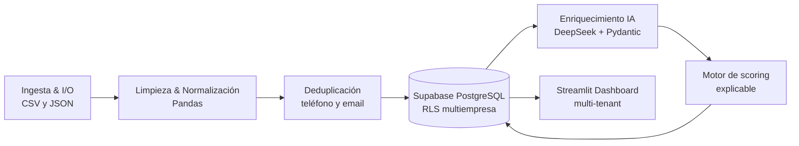

# 🏗️ Arquitectura y Diseño del Sistema

**Cliente:** Motos y Servicios de Colombia S.A.S.
**Proyecto:** Sistema de Ingesta, Enriquecimiento con IA y Priorización Automatizada de Leads

## 📌 1. Visión General de la Arquitectura

La solución convierte archivos de leads y conversaciones de WhatsApp en una lista diaria, priorizada y explicable para gestión comercial. Su arquitectura es un ETL/ELT modular orientado a servicios: cada módulo tiene una responsabilidad concreta, los datos persistentes viven en Supabase PostgreSQL y el tablero consume únicamente la información necesaria para operar.



El flujo principal se ejecuta con `python -m pipeline.main` y está programado en GitHub Actions. Primero ingiere los archivos fuente sin pasos manuales, normaliza los valores, consolida duplicados y sincroniza entidades maestras y leads. Después identifica conversaciones pendientes, las procesa con DeepSeek, persiste las señales extraídas y calcula el score final.

La base relacional modela la estructura comercial con `empresa`, `punto_venta` y `asesor`; el catálogo reside en `moto_catalogo`. La entidad central `lead` conserva los IDs de origen para trazabilidad tras la deduplicación. Las relaciones 1:1 `lead_enriquecido` y `lead_score` almacenan respectivamente la extracción IA y la explicación de priorización.

## 📐 2. Patrones de Diseño Aplicados

### 2.1 Repository / DAO Pattern

`pipeline/carga_supabase.py` concentra el acceso a Supabase. Funciones como `cargar_leads_supabase`, `cargar_registros_supabase` y `guardar_leads_enriquecidos_en_supabase` traducen DataFrames y DTOs a contratos de tablas, manejan lotes y ejecutan `upsert`.

Así, los módulos de negocio no construyen consultas PostgREST ni conocen detalles de credenciales. Por ejemplo, `scoring.py` recibe DataFrames y devuelve otro DataFrame con el contrato de `lead_score`; la persistencia se delega al módulo de carga. Esto reduce acoplamiento y permite sustituir el adaptador de persistencia sin reescribir la lógica comercial.

### 2.2 Factory / Strategy Pattern

El motor de priorización está aislado en `pipeline/scoring.py`. `calcular_scores` funciona como la estrategia vigente (`reglas-v1`): compone señales de intención, cita, capacidad de pago y contacto en las primeras 24 horas, y devuelve además los factores y una justificación legible.

La frontera de extensión es el contrato de entrada/salida de `calcular_scores`: una nueva estrategia, por ejemplo una regresión entrenada con `historico_cierres.csv` o pesos distintos por canal, puede implementar el mismo contrato y ser seleccionada por configuración. La versión se persiste en `lead_score.version_modelo`. Actualmente no existe una clase `Factory` formal; la estrategia es una implementación funcional, deliberadamente simple y fácil de auditar para el alcance del ejercicio.

### 2.3 Data Transfer Object (DTO) con Pydantic

`LeadEnriquecidoSchema` y `BatchResultados` en `pipeline/extraccion_ia.py` definen el contrato esperado de DeepSeek: intención, pago, cuota inicial, cita, objeciones, competencia, urgencia y resumen. El prompt exige JSON con esta estructura y valores controlados.

Los DTOs documentan y tipan el contrato que debe cumplir el proveedor. La ejecución actual exige JSON, normaliza valores serializables, valida colecciones y resuelve la identidad del lead antes de persistir. Como mejora futura, el JSON recibido puede validarse directamente contra `BatchResultados` con `model_validate` para que Pydantic aplique el contrato en tiempo de ejecución antes del mapeo.

### 2.4 Batch Processing Pattern

Las conversaciones se envían a DeepSeek en micro-lotes configurables (`tamano_lote`); la carga a PostgREST usa lotes de hasta 250 registros. Esto evita payloads excesivos, reduce el riesgo de timeouts y permite que una ejecución procese de forma eficiente el volumen de leads sin hacer una llamada por cada fila.

## 🧱 3. Principios SOLID

### SRP — Single Responsibility Principle

Cada módulo tiene una responsabilidad definida:

- `ingesta.py`: lectura de archivos fuente.
- `normalizacion.py`: estandarización de teléfono, fecha, ciudad y modelo.
- `deduplicacion.py`: consolidación de identidades y trazabilidad de IDs originales.
- `extraccion_ia.py`: conversación con DeepSeek y recuperación de respuestas.
- `scoring.py`: reglas de priorización y explicación del score.
- `carga_supabase.py`: adaptación y persistencia en Supabase.
- `dashboard/app.py`: presentación, filtros y detalle operativo.

### OCP — Open/Closed Principle

El pipeline está abierto a extensión sin modificar sus responsabilidades centrales. Se pueden agregar canales en la capa de ingesta, nuevos normalizadores, campos extraídos por IA o una nueva estrategia de score manteniendo los contratos de DataFrame y de persistencia. Los factores actuales están centralizados, por lo que el cambio de pesos no se dispersa por el dashboard o la base de datos.

### LSP / ISP — Sustitución e interfaces pequeñas

El proyecto no usa una jerarquía de clases artificial para los pasos de datos. En su lugar, trabaja con contratos pequeños y explícitos: DataFrames con las columnas requeridas, diccionarios JSON serializables y DTOs Pydantic. Cada transformación consume solo las columnas que necesita y entrega una estructura acotada para el siguiente paso. Esto evita interfaces gigantes, reduce dependencias implícitas y permite sustituir un normalizador o una estrategia de scoring sin afectar consumidores ajenos.

### DIP — Dependency Inversion Principle

Las dependencias de infraestructura se configuran fuera del código mediante variables de entorno: `SUPABASE_URL`, `SUPABASE_SERVICE_ROLE_KEY` y `DEEPSEEK_API_KEY`. Los módulos de negocio dependen de contratos de datos; el cliente de Supabase y el proveedor de IA se inicializan como adaptadores. Ninguna llave se versiona en el repositorio.

## 🔒 4. Arquitectura de Seguridad & Multi-Tenancy (RLS)

Supabase aplica Row Level Security (RLS) para aislar la información por `empresa_id`. El JWT de un usuario autenticado debe incluir `app_metadata.empresa_id`; las políticas lo comparan con la empresa dueña de cada lead. `lead_enriquecido` y `lead_score` heredan el aislamiento mediante su relación con `lead`.

La política principal está versionada en [`db/schema.sql`](db/schema.sql):

```sql
CREATE POLICY lead_isolation ON lead
    FOR ALL
    USING (
        empresa_id = auth.jwt() -> 'app_metadata' ->> 'empresa_id'
    )
    WITH CHECK (
        empresa_id = auth.jwt() -> 'app_metadata' ->> 'empresa_id'
    );
```

La separación de privilegios es obligatoria:

- **ETL y CI/CD (backend):** usan `SUPABASE_SERVICE_ROLE_KEY` exclusivamente en un entorno de servidor o secretos de GitHub Actions. Esta clave omite RLS y permite cargar maestros, leads y resultados del pipeline.
- **Dashboard para usuarios:** debe usar la clave pública/anónima junto con el JWT de la sesión. Las policies RLS determinan las filas visibles; la clave de servicio nunca se expone al navegador.

Para una demostración de una sola empresa con backend Streamlit, se puede fijar `DASHBOARD_EMPRESA_ID` como control adicional de consulta. Ese filtro no sustituye RLS en un escenario multiusuario.

## ⚡ 5. Resiliencia y Manejo de Fallos (Defensive Engineering)

### Upsert idempotente

Los leads consolidados reciben un UUID determinista basado en sus IDs de origen. El pipeline usa `upsert` sobre `lead_id`, de modo que una reejecución no genera duplicados. Antes de insertar enriquecimientos, elimina resultados repetidos por `lead_id`, conservando el último; así evita el conflicto de Postgres cuando un mismo `upsert` intenta afectar dos veces una fila única.

### Mapeo posicional e inverso de identificadores

DeepSeek procesa chats en el mismo orden del lote. Si omite un `lead_id`, `completar_lead_ids_por_posicion` lo recupera desde la conversación fuente. Al persistir, los IDs legibles originales se resuelven contra `lead.lead_id_original` para obtener el UUID consolidado. Si el vínculo no existe, el resultado se omite con advertencia en vez de asociarlo a una persona equivocada.

### Tolerancia a rate limits y entradas anómalas

La integración con DeepSeek reintenta ante respuestas `429` y `503` con espera incremental. Errores no recuperables se registran y el lote devuelve un resultado seguro. La serialización protege a PostgREST de `NaN`, timestamps o escalares NumPy no válidos; además, las validaciones de campos requeridos detienen una carga inconsistente antes de enviarla a la base.

## 🛠️ 6. Stack Tecnológico & Ejecución

### Stack

- **Python 3.11**, Pandas y NumPy para procesamiento de datos.
- **Pydantic** para contratos de extracción y validación.
- **Supabase Client / PostgreSQL** para persistencia, `upsert` y RLS.
- **OpenAI Client** configurado contra la API de **DeepSeek**.
- **Streamlit** para el dashboard operativo.
- **Pytest** para pruebas unitarias.
- **GitHub Actions** para calidad, ejecución manual y ejecución programada diaria.

### Requisitos y configuración

```bash
python -m venv .venv

# Windows
.venv\Scripts\activate

# Linux / macOS
source .venv/bin/activate

pip install -r requirements.txt
```

Crear un archivo `.env` en la raíz del proyecto, sin versionarlo:

```dotenv
SUPABASE_URL=https://<proyecto>.supabase.co
SUPABASE_SERVICE_ROLE_KEY=<solo-backend>
DEEPSEEK_API_KEY=<clave-deepseek>
```

Antes de la primera carga, ejecutar el DDL de [`db/schema.sql`](db/schema.sql) en el SQL Editor de Supabase. Configurar las mismas credenciales como secrets en GitHub Actions para la ejecución programada.

### Ejecutar el pipeline y el dashboard

```bash
# Desde la raíz del repositorio: ingesta → normalización → deduplicación
# → Supabase → IA → scoring → Supabase
python -m pipeline.main

# Dashboard local
streamlit run dashboard/app.py
```

### Ejecutar pruebas unitarias

```bash
pytest -q
```

Las pruebas actuales verifican la deduplicación por teléfono y el cálculo de un score completo. Antes de una entrega o despliegue, ejecutar las pruebas y confirmar que el dashboard publicado carga datos usando sus secrets de servidor.

## 📦 Entregables y operación

La entrega debe incluir el enlace a este repositorio y una URL pública funcional del dashboard. Para la sustentación se recomienda demostrar: ejecución del pipeline, modelo de datos y RLS en Supabase, lista priorizada, detalle IA de un lead y la lógica explicable del score.

La solución está diseñada para ejecutarse automáticamente mediante GitHub Actions a las 06:00 hora de Colombia (11:00 UTC), además de poder ejecutarse manualmente con `workflow_dispatch`.
